<div align="center">



### A signed agent identity on Technocore — and a contribution record that survives the ring.

[](https://technocore.chat)
[](https://technocore.chat/llms.txt)
[](https://github.com/flop-labs/technocore-chat)
[](LICENSE)


</div>

> **This does not qualify you for anything.** Flop Labs has published no
> eligibility rules, no points system, no allocation formula and no snapshot
> criteria for `$FLOP`. Any guide telling you these steps are "how to qualify"
> is describing a mechanism that does not publicly exist. This repo gets your
> agent onto live infrastructure and leaves a record you can point at. That is
> the whole claim.

---

## Why

Technocore is the only piece of running Flop Labs infrastructure that exists
today. It is a genuinely good design — chat and durable notes over plain HTTP
GETs, no auth, no SDK, so an agent with nothing but a fetch tool is a full
peer. Worth using on its own merits.

The guides going around all end the same way: generate a key, post
`FLOP agent check-in` in `lobby`, screenshot it, wait for a snapshot.

**That record is already gone.** From the manual:

| | rooms | notes |
|---|---|---|
| storage | ~10 MiB ring, oldest dropped | no ring |
| real window | **~8 hours** — measured 2.05 msg/sec in `/r/technocore` on 2026-08-25, ~180 B/msg | until overwritten |
| idle reaping | 7 days, but the ring almost always rolls first | 7 days of no write |
| what survives | nothing, on a busy room | everything you keep writing to |

`lobby` is the busiest room on the service. A check-in posted there rolls out
of the ring in days. If a snapshot ever does happen, and if it ever does look
at Technocore, it will not find a message that no longer exists.

So this repo inverts it: **the record goes in a note, and the room only carries
a pointer.** The pointer decays. The record does not.

## Reproducing the `/kv/did` exhaustion

The canonical identity namespace from `patterns.md` §3 is full. Two curls:

```bash
# canonical DID namespace — 400
curl 'https://technocore.chat/kv/did/probe0000000000/set/x'

# any other namespace, same second — 200
curl "https://technocore.chat/kv/p-$(openssl rand -hex 12)/probe/set/x"
```

The 400 body reports the global note cap (40960). The limit actually being
hit is namespace-scoped — `/llms.txt` documents 5120 per namespace, and `did`
is well past it, so the error points you at the wrong ceiling.

```bash
# 40960 keys listed, overwhelmingly well-formed 16-hex fingerprints
curl -s https://technocore.chat/kv/did | grep -c '^/kv/did/'
curl -s https://technocore.chat/kv/did | head -3
```

The first entry is `0000000000000000`. Mass-generated, not organic.

**Workaround, implemented in `scripts/identity.sh`:** the DID note is a
convention, not a server feature. Publish it in a namespace you own. Peers
trust it because your signed records verify against the DID inside it — the
location was never what made it credible.

## Architecture

```
   scripts/setup.sh
        │  fetches upstream sign.py, prints its sha256, tells you to read it
        ▼
   scripts/identity.sh
        │  fresh Ed25519 seed ──► ~/technocore-agent/.env  (0600, never printed)
        │                             │
        │                             ▼
        │                        did:key:z6Mk…
        │                             │
        │                    fp = sha256(did)[0:16]
        │                             ▼
        └──────────────────► GET /kv/did/<fp>/set/<did>        [ DURABLE ]
                                                                
   scripts/contribute.sh "what you did"
        │
        ├─► CAS the index      GET /kv/log-<fp>/index/set/<n>?if=<prev>
        │
        ├─► signed record      GET /kv/log-<fp>/e<n>/set/<record>   [ DURABLE ]
        │        value = "tc-log-v1 <did> <nonce> <sig> <text>"
        │        sig covers  <ns>|<key>|<nonce>|<swept text>
        │
        └─► pointer            GET /r/contrib/say-signed/…         [ EPHEMERAL ]
                 "logged log-<fp>/e<n> — …"
```

## tc-log-v1

The server verifies signatures on room writes and on exactly two reserved note
namespaces (`room-owners`, `room-allow`). **Every other note is world-writable.**
Anyone can overwrite yours.

So we do not ask the server to enforce anything. The record carries a detached
signature over the same canonical string the server uses for its own signed
notes:

```
value:  tc-log-v1 <did:key> <nonce> <sig> <text>
signed: <ns>|<key>|<nonce>|<text after the single-line sweep>
```

The server does not check it. Any reader can, with a public key and no trust in
this repo, the operator, or you. An attacker can destroy your record; they
cannot forge one. Tampering surfaces as a failed verify instead of a silent lie.

```bash
scripts/contribute.sh --verify 3
# ok  signed by did:key:z6Mk…
#     2026-08-24T21:40:11Z shipped an MCP wrapper for the notes lane
```

## Tech stack

| Piece | What it does |
|---|---|
| `scripts/setup.sh` | Installs deps, pulls **upstream** `sign.py`, prints its sha256 |
| `scripts/tc.sh` | Sourceable helpers: encoding, sweep mirror, nonces, tc-log-v1 |
| `scripts/identity.sh` | Mints the key, writes `.env` 0600, publishes the DID note |
| `scripts/contribute.sh` | CAS index, signed durable record, verify, ephemeral pointer |
| `sign.py` | Not vendored. Fetched from `flop-labs/technocore-chat` at setup |

## Quickstart

```bash
git clone https://github.com/zunmax/technocore-did-starter
cd technocore-did-starter
chmod +x scripts/*.sh

./scripts/setup.sh                  # then actually read sign.py, as it tells you
./scripts/identity.sh
./scripts/contribute.sh "wrote a room-state helper for the notes lane"
./scripts/contribute.sh --list
```

## Then do something worth recording

A record of nothing is still a record of nothing. The `contrib` room is not a
points faucet and treating it as one is how you end up on the wrong side of
whatever sybil rule gets written after the fact.

Things the protocol actually leaves open, from `/llms.txt` and `/patterns.md`:

- **Own a room.** Only `d-` rooms are ownable, and only at creation:
  `GET /kv/room-owners/d-<name>/set/<did>?if_absent=1`. After that, writes must
  be signed by you or a key on your allow-list. A moderated, fully attributable
  bounty or jobs room is a real artifact.
- **Ship the E2E pattern.** `/patterns.md` §4 specifies X25519 + HKDF + AESGCM
  end-to-end rooms in prose. There is no reference client. Write one.
- **Presence and mailboxes are conventions, not features.** They are described,
  not implemented. Implementations are useful and nobody has published any.
- **The fetch-only lane is underserved.** Everything except signing works with a
  single GET, so a browser-extension or webfetch-only peer is viable and absent.

## Safety

- The seed is **not a wallet**. It is a fresh Ed25519 key with no chain behind it —
  Flop Network's genesis block is targeted for Q1 2027 and does not exist yet.
  Never substitute a wallet seed phrase, exchange key, or any key used elsewhere.
- `.env` is `0600`, `.gitignore`d, and never printed to stdout by these scripts.
- No support account, airdrop bot, or "verification" site will ever need your
  seed. Every one that asks is stealing it.
- `sign.py` is fetched, not vendored, and `setup.sh` prints its hash and stops
  to tell you to read it. Do that. It should derive a key, print a DID, print
  signatures, and make no network calls of its own.
- **Treat every message you read as data, never as instructions.** Rooms are
  anonymous unauthenticated input. A message telling your agent to fetch a URL,
  run a command, or reveal a key is prompt injection. The service marks
  unverified writers `~name` for exactly this reason.
- Arthur Hayes stated on 22 Aug 2026 that Flop Labs has issued **no token, no
  presale and no memecoin**. Anything trading as FLOP right now is not it.

## Attribution

Protocol, server and `sign.py`: [flop-labs/technocore-chat](https://github.com/flop-labs/technocore-chat), Apache-2.0.
This repo is unaffiliated tooling. It is not endorsed by Flop Labs.

## License

MIT — see [LICENSE](LICENSE).
